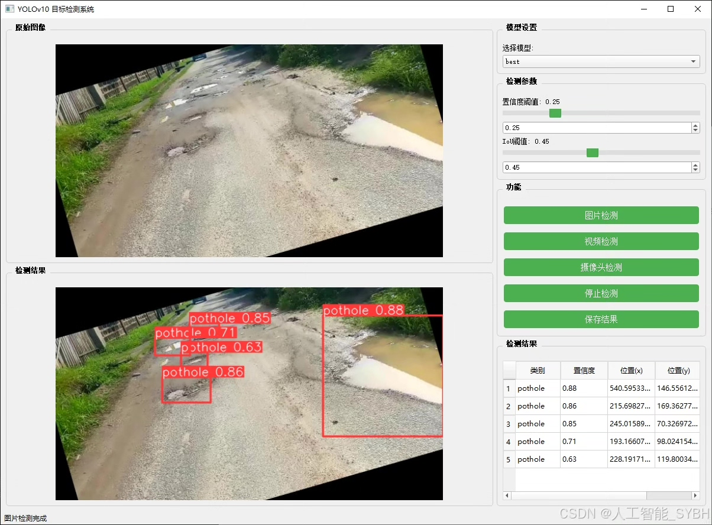
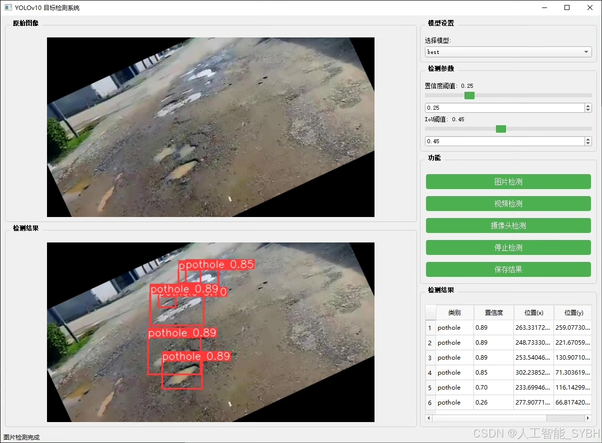
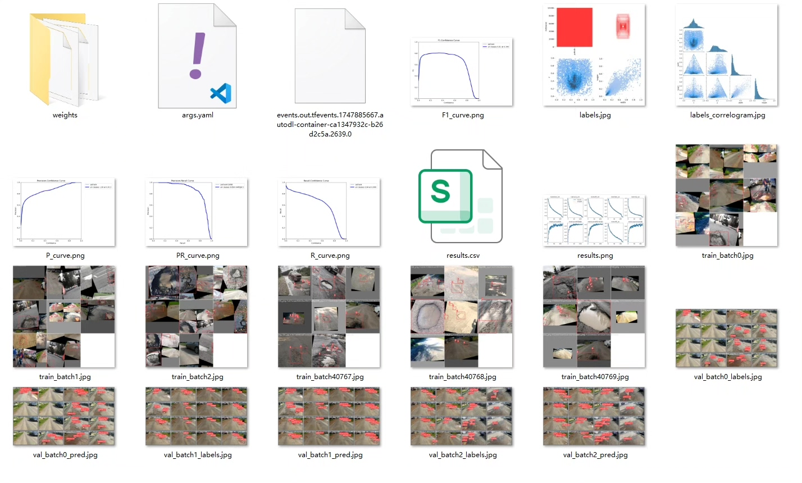
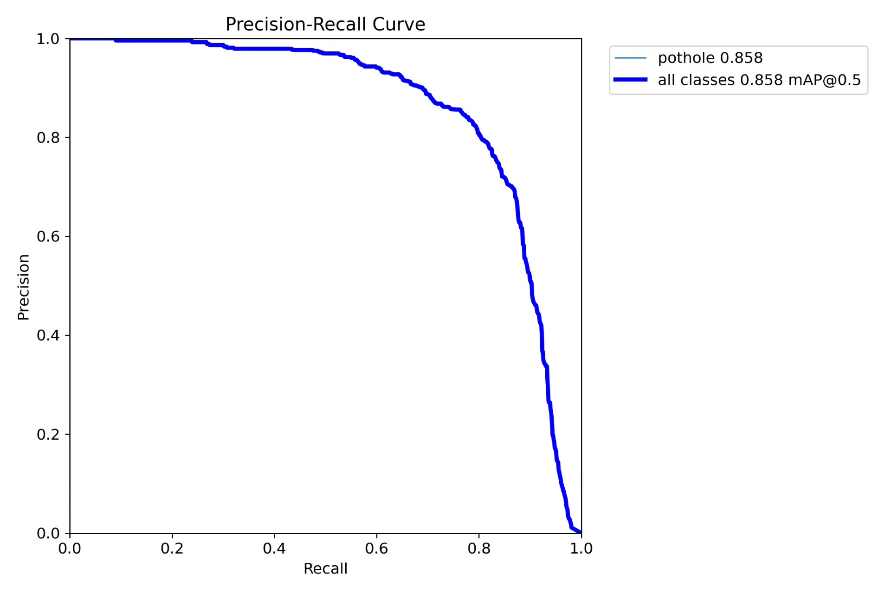
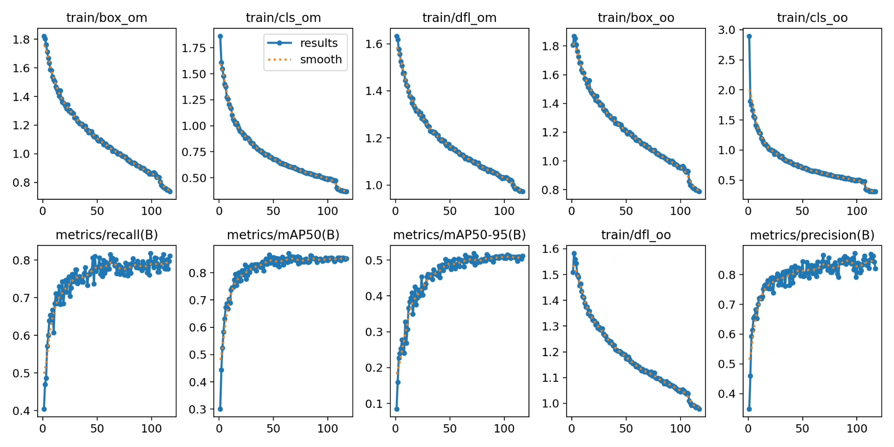
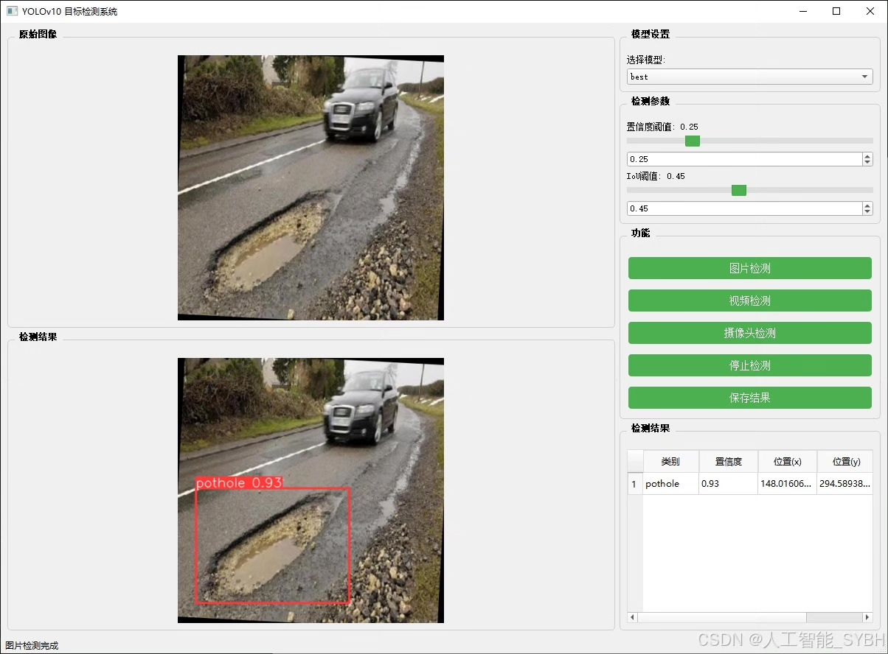
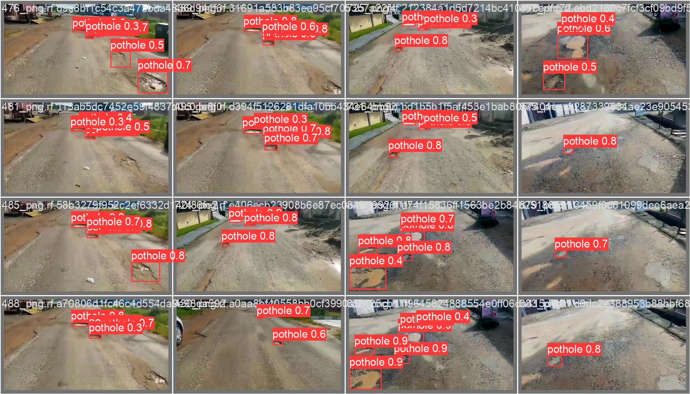
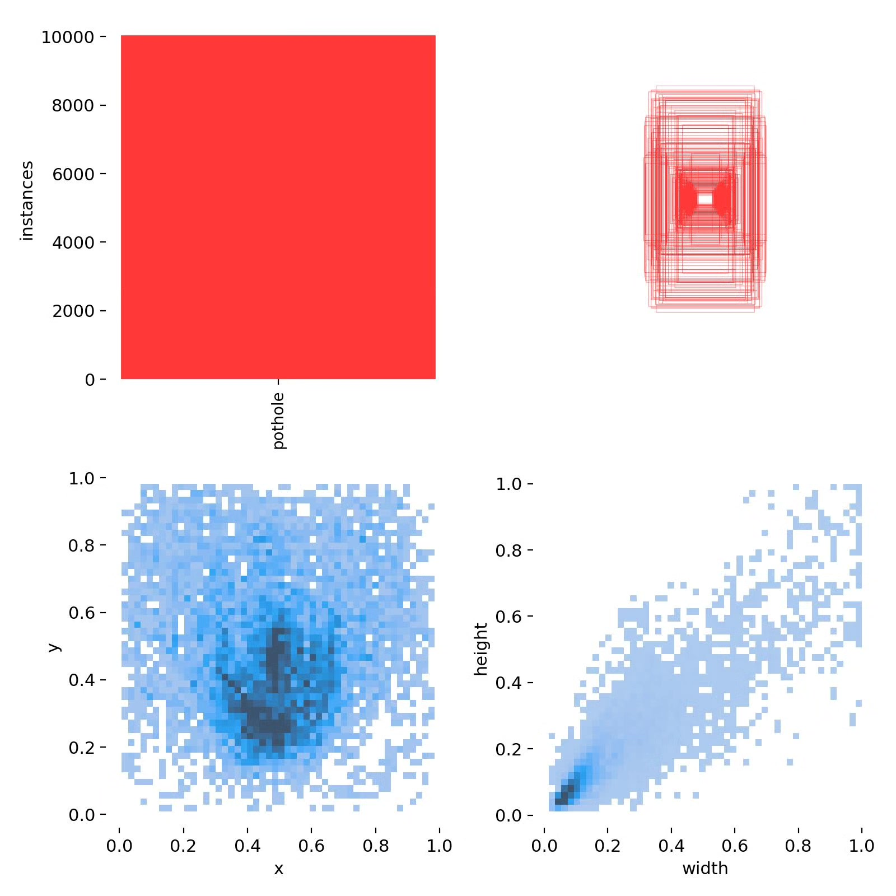

# Based on deep learning YOLOv10 road pothole detection system (YOLOv

## Body

Based on the YOLOv10 deep learning framework, this project has developed a high-precision road pothole detection system. It is specifically designed for automatically detecting various types of pothole damage on road surfaces. The system uses a professional dataset containing 3,490 road pothole images for training and evaluation, with 3,043 training images, 273 validation images, and 174 test images. This system achieves precise recognition of pothole targets in complex road environments and can effectively cope with challenges such as different lighting conditions, road surface materials, and weather conditions. The system can be widely applied in areas such as municipal road maintenance, autonomous driving environment perception, fleet management systems, and smart city construction, providing intelligent solutions for road safety maintenance.

The company's products have obtained YOLO official commercial license certification.

We provide after-sales service.

After payment, we will provide WeChat ID to answer questions anytime.

Environmental configuration: We will provide a tutorial on environmental configuration, and WeChat will provide答疑.

Remote installation service: If you need remote configuration, an additional fee of 69 is required.
If the configuration fails, all fees will be refunded (specially for old computers only refund installation fees).

Retraining dataset: After configuring the environment, you can train on your own computer.
If you need us to retrain, just pay 69 + computing power fees (2.5 yuan/hour)

## Images

## Payment

Here is a pay link on Stripe ( https://buy.stripe.com/3cs8yP7sY87d0vu9AB ). Please contact me lonlonago@foxmail.com after funding $89, and I will send you a complete data files , thank you!

